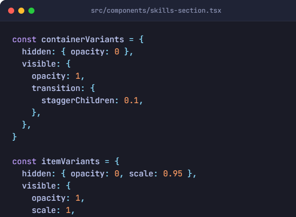
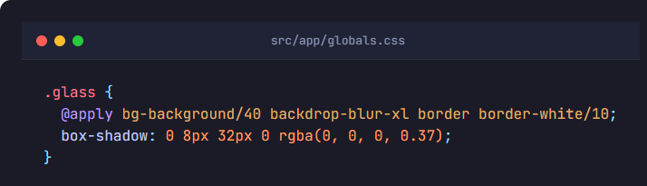
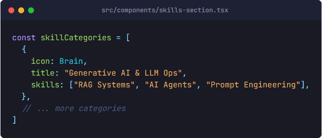

# Building a Premium AI Portfolio: A Technical Deep Dive into Next.js 15 & Framer Motion

As AI Engineers, our work often exists in the invisible layers of model architecture and data pipelines. However, to stand out in a global talent market, how we present that work is just as critical as the work itself. A "premium" portfolio doesn't just list skills; it demonstrates technical sophistication through every pixel and animation.

In this tutorial, I’ll walk you through the engineering behind my own AI portfolio, focusing on two key pillars of a high-end UI: **staggered motion orchestration** and **modern glassmorphism design**.

---

## 1. The Stack: Why Next.js 15 & Tailwind 4?
For an AI-centric site, speed and modern foundations are non-negotiable. I chose:
- **Next.js 15**: For the latest React features and lightning-fast Server Components.
- **Tailwind CSS 4**: For its streamlined utility engine.
- **Framer Motion**: The industry standard for declarative animations in React.

---

## 2. Technical Deep Dive: Staggered Entrance Animations
When a user lands on your "Skills" section, you want the information to feel "revealed" rather than just appearing. We achieve this using **Staggered Children**.

Instead of manually timing every card, we define an orchestration logic in the parent container.

### The Implementation
Here is how we define the animation variants:

**How it works:**
The `staggerChildren: 0.1` property is the hero here. It tells Framer Motion to wait 0.1 seconds between triggers for each child element. This creates a smooth, professional "waterfall" effect that guides the user's eye across your expertise categories.

---

## 3. Mastering Glassmorphism: Depth Without Clutter
A hallmark of modern AI dashboards (like OpenAI’s or Anthropic’s) is **Glassmorphism**. It allows for high visual density without feeling "heavy."

Instead of using multiple custom classes, I built a reusable utility in my global CSS.

**Key Components:**
- `backdrop-blur-xl`: This creates the frosted glass effect, blurring the animated background behind the card.
- `bg-background/40`: By using a semi-transparent version of my theme's primary background color, we maintain color consistency while adding depth.
- **Single Border Strategy**: Notice the `border-white/10`. In dark mode, a extremely subtle light border creates the illusion of a light source, giving the card a "3D" feel.

---

## 4. UI Architecture: Responsive Data Mapping
To keep the component clean (crucial for long-term maintenance), I separated the skills data from the JSX structure.

### The Implementation
By separating the data from the structure, we ensure the UI remains predictable and easy to scale.

By mapping over this array, we ensure that adding a new skill doesn't require rewriting complex UI code. Every card automatically inherits the `.glass` styling and staggered animation logic we defined earlier.

---

## Conclusion: Balancing Performance with Aesthetics
A premium portfolio is a high-performance machine. By leveraging Next.js 15’s efficiency and Framer Motion’s declarative power, we can create a high-fidelity experience that loads in milliseconds.

For an AI Engineer, your portfolio is your first technical publication. Make it count.

---

### Resources & Links:
- **Live Demo**: [bassey-riman.vercel.app](https://bassey-riman.vercel.app)
- **GitHub Repository**: [portfolio-website](https://github.com/basseyriman/portfolio-website)

---
*If you found this tutorial helpful, feel free to reach out on LinkedIn or GitHub to discuss AI, MLOps, or UI engineering!*
